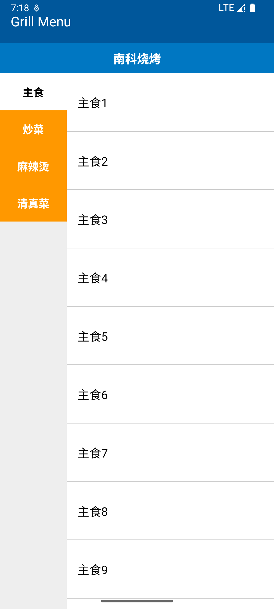
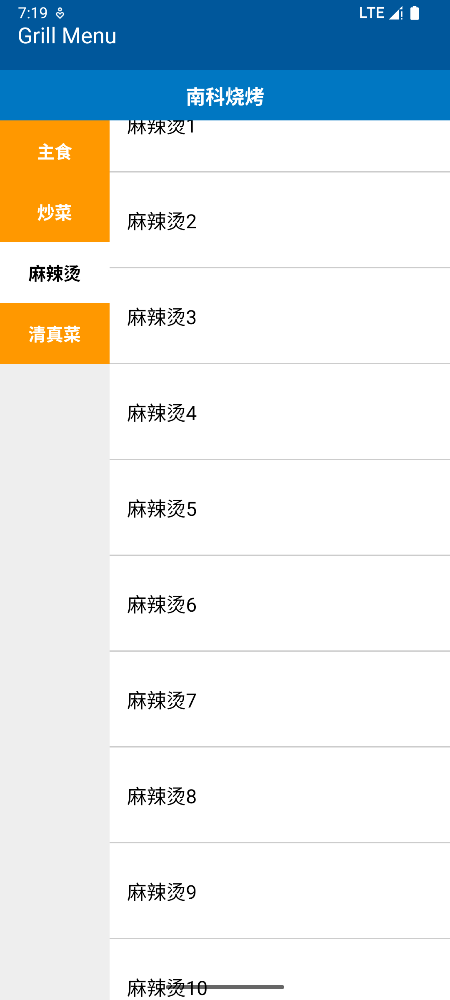
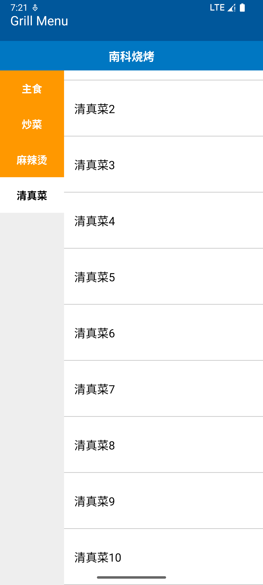

# Android Studio Assignment2 Report

## 1. 实验目的

本次实验旨在利用 Android Studio 和 Java 语言，设计并实现一个模拟购物或餐厅菜单应用的双栏用户界面。核心目标是使用 `RecyclerView` 来分别展示左侧的分类列表和右侧对应的项目列表，同时满足特定的视觉样式、交互逻辑以及后续提出的修改要求（如分类颜色反转、项目分隔线等）。

## 2. 实验要求

根据初始要求及后续修改，应用程序需满足以下具体规范：

*   **基本布局:** 实现左右并排的双栏布局，左侧为分类列表 (`RecyclerView`)，右侧为项目列表 (`RecyclerView`)。
*   **数据内容:**
    *   分类: 包含 “主食”、“炒菜”、“麻辣烫”、“清真菜”。
    *   项目: 每个分类下最初要求精确显示 10 个项目（例如，“主食1” 到 “主食10”）。后修改为可通过常量 (`ITEMS_PER_CATEGORY`) 配置项目数量。
*   **视觉样式与交互 (最终版):**
    *   **默认状态:** 应用启动时，默认选中第一个分类（“主食”）。
    *   **选中分类:** 左侧被选中的分类项，其背景显示为**白色**，文字显示为**黑色**。
    *   **未选中分类:** 左侧所有未被选中的分类项，其背景显示为**橙色**，文字显示为**白色**。
    *   **项目列表:** 右侧的项目列表区域，其背景始终保持**白色**。
    *   **分隔线:** 右侧项目列表中的每个项目之间，需要显示水平分隔线。
*   **项目高度:** 右侧项目列表中的单个项目应具有增加的垂直内边距（Padding）或高度，使得即使项目数量不多，列表整体看起来也更长（通过修改 `list_item_food.xml` 实现）。
*   **报告:** 提供源代码和一份记录实现过程的报告，其中包含最终应用在不同分类选中状态下的截图。

## 3. 系统设计与架构

本应用遵循标准的 Android 结构：

*   **`MainActivity.java`:** 作为应用的主 Activity 和控制器。负责初始化界面组件、准备数据（使用 `LinkedHashMap` 映射分类名到项目字符串列表）、设置 `RecyclerView` 的适配器（Adapter）、通过 `OnCategoryClickListener` 接口处理分类选择与项目列表更新之间的交互，并为项目列表配置 `DividerItemDecoration`。
*   **`CategoryAdapter.java`:** 管理左侧分类 `RecyclerView` 的数据和视图。它持有分类名称列表，处理视图的创建 (`onCreateViewHolder`) 和数据绑定 (`onBindViewHolder`)，管理选中项的位置 (`selectedPosition`)，根据选中状态应用正确的背景色和文字颜色，并通过 `OnCategoryClickListener` 接口将点击事件通知给 `MainActivity`。
*   **`ItemAdapter.java`:** 管理右侧项目 `RecyclerView` 的数据和视图。它持有*当前选中*分类对应的项目列表，处理视图创建和数据绑定，并提供 `updateData` 方法供 `MainActivity` 在分类切换时刷新列表内容。
*   **布局文件 (XML):**
    *   `activity_main.xml`: 定义了应用的整体结构（使用 `LinearLayout`），包含模拟的 Toolbar/标题区域，以及容纳两个 `RecyclerView` 的水平布局。
    *   `list_item_category.xml`: 定义单个分类项的布局（一个 `TextView`）。
    *   `list_item_food.xml`: 定义单个菜单项的布局（一个具有增加内边距/高度的 `TextView`）。
*   **资源文件:**
    *   `colors.xml`: 定义应用中使用的颜色值（如 `category_highlight_orange`、`white`、`black` 等）。
    *   `strings.xml`: 定义字符串资源（如分类名称、应用标题等）。
    *   `drawable/divider_line.xml`: 定义项目列表分隔线的视觉外观（颜色、粗细）。

## 4. 实现细节

### 4.1. 主布局 (`activity_main.xml`)

使用水平 `LinearLayout` 排列两个 `RecyclerView`。左侧 (`recyclerViewCategories`) 具有固定宽度，右侧 (`recyclerViewItems`) 使用 `layout_weight="1"` 填充剩余空间。

```xml
<!-- 在主垂直 LinearLayout 内部 -->
<LinearLayout
    android:layout_width="match_parent"
    android:layout_height="match_parent"
    android:orientation="horizontal">

    <!-- 左侧面板: 分类 RecyclerView -->
    <androidx.recyclerview.widget.RecyclerView
        android:id="@+id/recyclerViewCategories"
        android:layout_width="100dp"
        android:layout_height="match_parent"
        android:background="@color/category_default_background" <!-- 初始背景，会被Adapter覆盖 -->
        app:layoutManager="androidx.recyclerview.widget.LinearLayoutManager"
        tools:listitem="@layout/list_item_category"/>

    <!-- 右侧面板: 项目 RecyclerView -->
    <androidx.recyclerview.widget.RecyclerView
        android:id="@+id/recyclerViewItems"
        android:layout_width="0dp"
        android:layout_height="match_parent"
        android:layout_weight="1"
        android:background="@color/white" <!-- 确保项目列表背景始终为白色 -->
        app:layoutManager="androidx.recyclerview.widget.LinearLayoutManager"
        tools:listitem="@layout/list_item_food"/>

</LinearLayout>
```

### 4.2. 数据准备 (`MainActivity.java`)

使用辅助方法动态生成数据。

```java
private static final int ITEMS_PER_CATEGORY = 10; // 或 30 等

private void prepareFoodData() {
    foodData = new LinkedHashMap<>();
    String mainCourse = getString(R.string.category_main_course);
    // ... 获取其他分类字符串 ...

    foodData.put(mainCourse, generateItems(mainCourse, ITEMS_PER_CATEGORY));
    // ... 添加其他分类 ...
}

private List<String> generateItems(String categoryPrefix, int count) {
    List<String> items = new ArrayList<>();
    for (int i = 1; i <= count; i++) {
        items.add(categoryPrefix + i);
    }
    return items;
}
```

### 4.3. 分类样式 (`CategoryAdapter.java`)

应用最终颜色方案的核心逻辑位于 `onBindViewHolder` 方法中。

```java
@Override
public void onBindViewHolder(@NonNull ViewHolder holder, int position) {
    String categoryName = categories.get(position);
    holder.categoryNameTextView.setText(categoryName);

    // --- 根据选中状态应用颜色样式 ---
    if (position == selectedPosition) {
        // *** 选中项样式 ***
        // 背景: 白色
        holder.itemView.setBackgroundColor(ContextCompat.getColor(context, R.color.white));
        // 文字: 黑色 (与白色背景形成对比)
        holder.categoryNameTextView.setTextColor(ContextCompat.getColor(context, R.color.black));
    } else {
        // *** 未选中项样式 ***
        // 背景: 橙色
        holder.itemView.setBackgroundColor(ContextCompat.getColor(context, R.color.category_highlight_orange));
        // 文字: 白色
        holder.categoryNameTextView.setTextColor(ContextCompat.getColor(context, R.color.white));
    }
    // --- 颜色样式结束 ---

    // 设置点击监听器...
    holder.itemView.setOnClickListener(v -> {
        // ... (更新 selectedPosition 并通知更改的逻辑) ...
        if (currentPosition != selectedPosition) {
            int previousSelectedPosition = selectedPosition;
            selectedPosition = currentPosition;
            listener.onCategoryClick(selectedPosition, categories.get(selectedPosition));
            notifyItemChanged(previousSelectedPosition); // 更新旧项样式
            notifyItemChanged(selectedPosition);     // 更新新项样式
        }
    });
}
```

### 4.4. 项目列表分隔线 (`MainActivity.java`)

在 `onCreate` 方法中配置并添加 `DividerItemDecoration`。

```java
// 在 onCreate 方法中，为 recyclerViewItems 设置 Adapter 之后
LinearLayoutManager itemsLayoutManager = new LinearLayoutManager(this);
recyclerViewItems.setLayoutManager(itemsLayoutManager);
recyclerViewItems.setAdapter(itemAdapter);

DividerItemDecoration dividerItemDecoration = new DividerItemDecoration(
        recyclerViewItems.getContext(),
        itemsLayoutManager.getOrientation() // 使用布局管理器的方向 (VERTICAL)
);

// 可选: 设置自定义的 Drawable
Drawable dividerDrawable = ContextCompat.getDrawable(this, R.drawable.divider_line);
if (dividerDrawable != null) {
    dividerItemDecoration.setDrawable(dividerDrawable);
}

// 将装饰器添加到 RecyclerView
recyclerViewItems.addItemDecoration(dividerItemDecoration);
```

### 4.5. 项目高度 (`list_item_food.xml`)

增加的内边距（padding）使每个项目更高。

```xml
<TextView xmlns:android="http://schemas.android.com/apk/res/android"
    android:id="@+id/textViewItemName"
    android:layout_width="match_parent"
    android:layout_height="wrap_content"
    android:paddingStart="16dp"
    android:paddingEnd="16dp"
    android:paddingTop="30dp"  <!-- 增加的内边距 -->
    android:paddingBottom="30dp" <!-- 增加的内边距 -->
    android:textSize="18sp"
    android:textColor="@color/black"
    android:gravity="center_vertical"
    android:background="?android:attr/selectableItemBackground" />
```

### 4.6. 交互逻辑

`CategoryAdapter` 中声明的 `OnCategoryClickListener` 接口由 `MainActivity` 实现。当一个分类被点击时，Adapter 调用 `MainActivity` 中的 `onCategoryClick` 方法。`MainActivity` 随后从 `foodData` 获取对应的项目列表，并调用 `itemAdapter.updateData()` 来刷新右侧的 `RecyclerView`。分类项的颜色变化由 `CategoryAdapter` 内部通过调用 `notifyItemChanged` 来处理。

## 5. 实验结果与截图

应用程序成功实现了所要求的双栏 `RecyclerView` 布局和交互逻辑。

*   分类在左侧显示，项目在右侧显示。
*   点击分类能正确更新右侧的项目列表。
*   分类列表应用了指定的颜色方案：选中项为白底黑字，未选中项为橙底白字。
*   项目列表保持白色背景，并在项目之间显示了分隔线。
*   通过调整内边距，项目具有了更大的垂直高度。


| 主食选中                | 麻辣烫选中                 | 清真菜选中                |
| :-------------------------: | :-------------------------: | :-------------------------: |
|  |   | 


## 6. 结论

本次实验成功运用 `RecyclerView` 构建了一个联动的、符合要求的双栏菜单/购物应用界面。关键技术点包括：

*   在单个 Activity 布局中使用多个 `RecyclerView` 实例。
*   实现自定义适配器 (`CategoryAdapter`, `ItemAdapter`) 来管理数据和视图绑定。
*   在 Adapter 内部处理并视觉化反映项目选中状态（背景/文字颜色变化）。
*   使用回调接口 (`OnCategoryClickListener`) 实现 Adapter 与 Activity 之间的通信。
*   根据一个 `RecyclerView` 中的选择动态更新另一个 `RecyclerView` 的内容。
*   通过 XML 布局自定义项目外观（内边距/高度）。
*   使用 `DividerItemDecoration` 和自定义 Drawable 添加视觉分隔线。

项目成功满足了所有指定需求，包括最终的颜色方案调整。

## 7. 源代码参考

`MainActivity.java`, `CategoryAdapter.java`, `ItemAdapter.java` 的完整源代码，以及所有相关的 XML 布局和资源文件，均包含在项目目录中。
